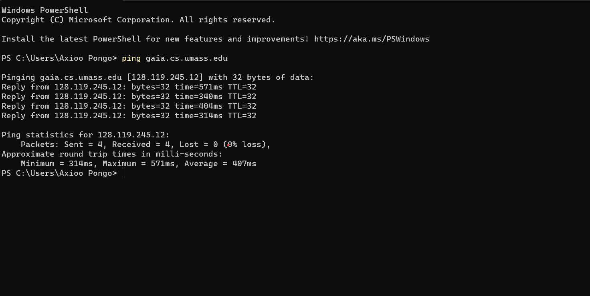
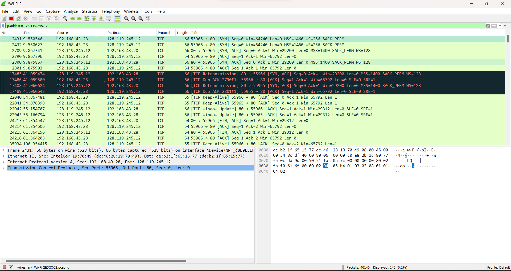
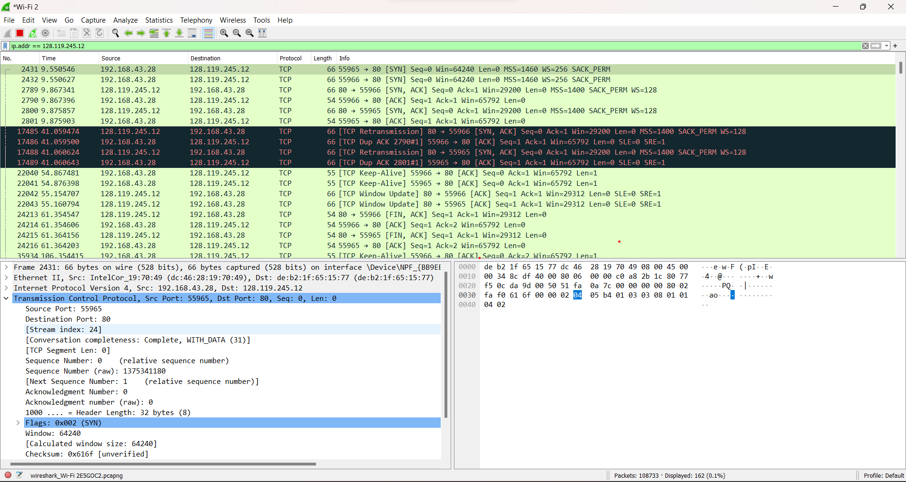
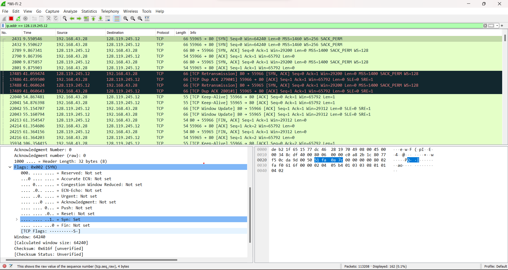
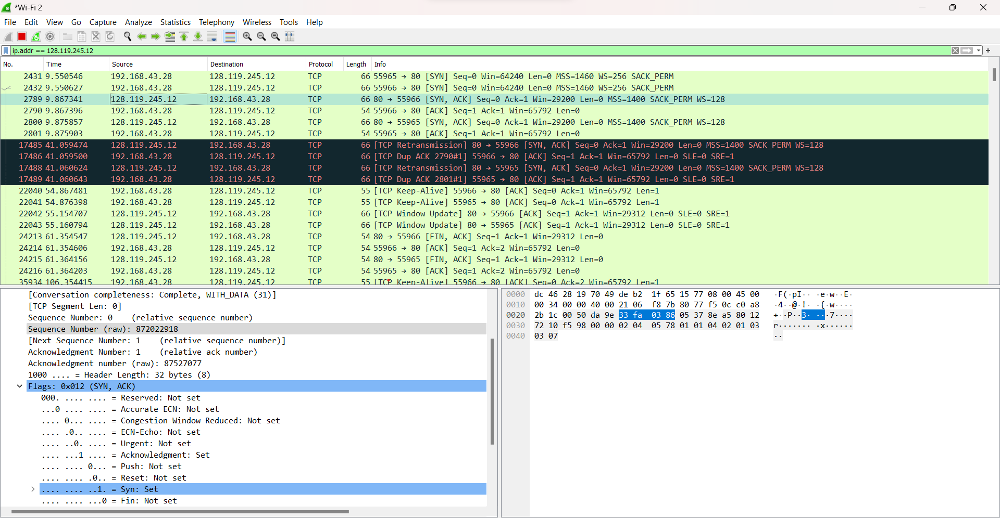

# 5025211251_MuhammadAhyunIrsyada_TugasTCP-UDP

## TCP 
### NO 1 

**Soal** 
    What is the IP address and TCP port number used by the client computer (source) that is transferring the file to gaia.cs.umass.edu?

**Penyelesaian**
-   Pertama tama cari IP dari `gaia.cs.umass.edu` dengan cara melakukan Ping di terminal

    
  
-   Lalu filter IP dari `gaia.cs.umass.edu` yang mana IPnya adalah `128.119.245.12` dengan script `ip.addr == 128.119.245.12`

    
  
-   Setelah melakukan trace maka IP address dari client computer adalah `192.168.43.28` dan menggunakan port 55965

### NO 2

**Soal**
    What is the IP address of gaia.cs.umass.edu? On what port number is it sending and receiving TCP segments for this connection?

**Penyelesaian**
-   Untuk mencari IP dari `gaia.cs.umass.edu` kita bisa menggunakan cara melakukan ping ke `gaia.cs.umass.edu` seperti soal sebelumnya 
-   Jadi IP dari `gaia.cs.umass.edu` adalah `128.119.245.12`
-   Untuk mencari Port dari `gaia.cs.umass.edu` bisa dengan cara melakukan filter di wireshark dengan script `ip.addr == 128.119.245.12` sama seperti soal sebelumnya
-   Jadi Port dari `gaia.cs.umass.edu` adalah `80`

### NO 3

**soal**
    What is the sequence number of the TCP SYN segment that is used to initiate the TCP connection between the client computer and gaia.cs.umass.edu? What is it in this TCP segment that identifies the segment as a SYN segment?Will the TCP receiver in this session be able to use Selective Acknowledgments?

**Penyelesaian**
-   Untuk mencari tahu sequence number dari segmen TCP SYN adalah dengan cara menekan paket pengiriman dengan info `[SYN]`  lalu cari `Transmission Control Protocol`,lalu tekan dan cari `sequence number (raw)` dan `sequence number `

    
  
-   Jadi sequence number dari TCP SYN tersebut adalah `sequence number = 0` atau `sequence number (raw) = 1375341180`
-   Untuk mencari tahu Penerima TCP menggunakan Selective Acknowledgments adalah dengan membuka `Flags :`

    

-   Jadi Di dalam packet tersebut terdapat flag SYN: Set yang menandakan bahwa packet tersebut adalah SYN segment, sehingga bisa digunakan sebagai selective acknowledgments

### NO 4

**Soal**
    What is the sequence number of the SYNACK segment sent by gaia.cs.umass.edu to the client computer in reply to the SYN? What is it in the segment that identifies the segment as a SYNACK segment? What is the value of theAcknowledgementfield in the SYNACK segment? How did gaia.cs.umass.edu determine that value?

**Penyelesaian**   
-    Untuk mencari tahu sequence number dari segmen TCP SYN adalah dengan cara menekan paket pengiriman dengan info `[SYN,ACK]`  lalu cari `Transmission Control Protocol`,lalu tekan dan cari `sequence number (raw)` dan `sequence number `

  

-    Jadi sequence number dari TCP SYNACK tersebut adalah `sequence number = 0` atau `sequence number (raw) = 872022918`
-    Untuk mencari acknowledgement number of the SYNACK segment adalah dengan number dari SYN segment ditambah 1 `(ACK=Seq no+1)` atau mencari `acknowledgement number` dan `acknowledgement number (raw)` di `Transmission Control Protocol` .
-    Jadi acknowledgement number dari TCP SYNACK tersebut adalah `acknowledgement number = 1` atau `acknowledgement number (raw) = 87527077`

### NO 5

**Soal**
    What is the sequence number of the TCP segment containing the header of the HTTP POST command? How many bytes of data are contained in the payload (data) field of this TCP segment? Did all of the data in the transferred file alice.txt fit into this single segment?

**Penyelesaian**
-   Pada packet HTTP POST, dapat dilihat seperti ini : (ss6)
    
-   Didapatkan sequence number of the HTTP POST segment adalah `147715`
-   Didapatkan payload (data) field of this TCP segment adalah payload = `5321 bytes`
-   Detail packet memiliki keterangan bahwa packet dikirimkan menggunakan multipart or MIME sehingga data yang dikirimkan tidak hanya satu segment saja, melainkan beberapa segment. Payload yang dikirimkan sebesar `5321 bytes` sedangkan alice.txt sebesar `149KB`

### NO 6

**Penyelesaian**
    Consider the TCP segment containing the HTTP “POST”as the first segment in the data transfer part of the TCP connection.
-    At what time was the firstsegment(the onecontaining the HTTP POST) in the data-transfer part of the TCP connection sent?
-    At what timewas the ACK for this firstdata-containing segment received?
-    What is the RTT for this first data-containing segment?
-    What is the RTT value the seconddata-carrying TCP segment and its ACK?
-    What is the EstimatedRTTvalue (see Section 3.5.3, in the text) after the ACK for the second data-carryingsegmentis received?
       
**Penyelesaian**
 (SS7)
- Dari screenshot di atas, didapatkan bahwa packet pertama dikirimkan pada frame: `83` dimana frame tersebut dikirimkan pada `9.375974` seconds (ss8)
- Didapatkan bahwa ACK dari packet pertama diterima pada frame: 7 dimana frame tersebut diterima pada 0.052671 seconds (ss9)
- screenshoot sebelumnya didapatkan untuk RTT dari segment pertama adalah 0.028624 seconds (ss10)
- Segment kedua dikirimkan pada frame: 5 yang dimana ACK dari segment kedua diterima pada frame: 8 sehingga didapatkan RTT dari segment kedua adalah 0.028628 seconds(ss11)

  
